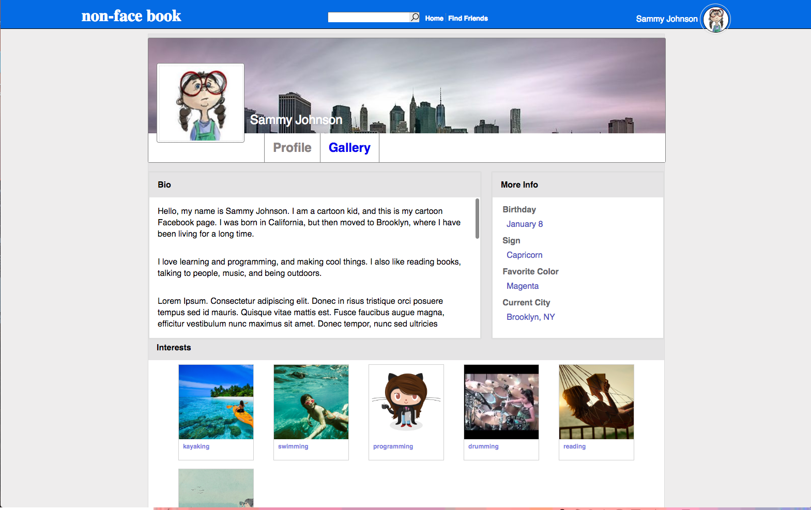
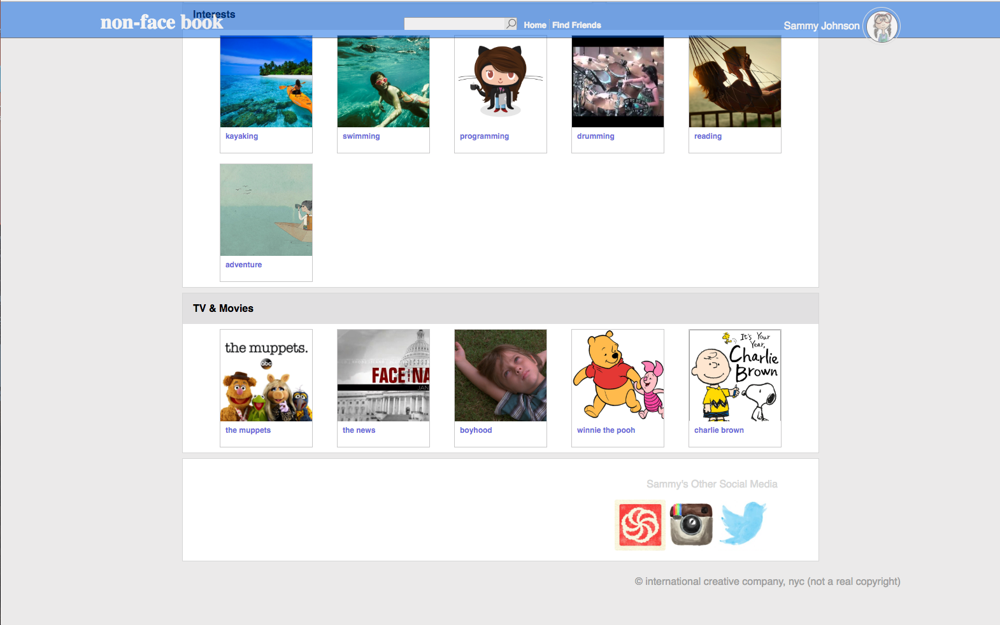
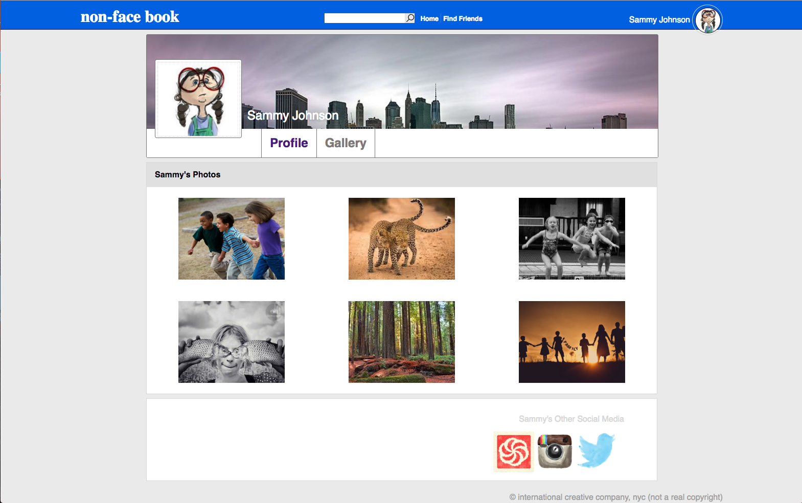

Foundations Assignement:
To create a profile page that links to a gallery with six images.
Layout created with pure CSS floats and flexbox.
Animations created with CSS transform property and vanilla JS.

top of page one:
create 
scroll-down page one:
create 
page two:
create 
